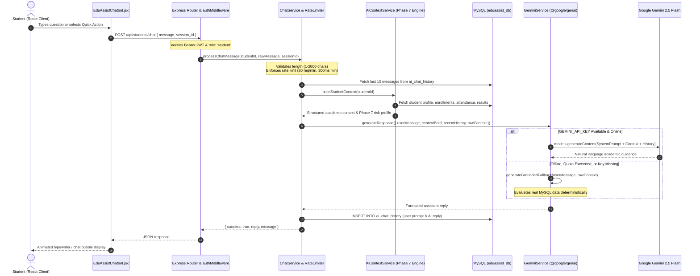

# EduAssistAI — AI Chatbot & Memory Integration Documentation

## 1. Overview & Architecture
The EduAssistAI Chatbot is an intelligent academic companion powered by Google Gemini (via the official `@google/genai` SDK) and tightly grounded in empirical university records from MySQL (`eduassist_db`). Rather than generating generic responses or hallucinating academic metrics, the chatbot injects real-time student data and diagnostic insights from the Phase 7 Academic Analysis Engine into every prompt, ensuring factual, personalized, and explainable guidance.



---

## 2. Student Context Builder (`aiContextService.js`)
Before sending any prompt to the Gemini API, `aiContextService` queries the authoritative MySQL database and invokes the Phase 7 Academic Analysis Engine (`academicAnalysisService.js`):

### Extracted Academic Grounding Attributes
1. **Student Core Identity**: `full_name`, `reg_number`, `department`, `academic_year`, `current_semester`.
2. **Authoritative GPA Profile**: Current cumulative GPA, baseline GPA, trend trajectory (`IMPROVING`, `STABLE`, `DECLINING`), and completed credits.
3. **Phase 7 Academic Risk Assessment**:
   - Risk Level (`LOW`, `MEDIUM`, `HIGH`)
   - Numerical Risk Score (0–100 Penalty model)
   - Diagnostic reasons (e.g., low attendance, overdue coursework, declining grades)
4. **Attendance Tracking**:
   - Overall course attendance percentage
   - Per-module breakdown (`attended_classes` / `total_classes`)
   - High-priority attendance warnings ($< 75\%$ or $< 60\%$ debarment thresholds)
5. **Coursework & Assessment Progress**:
   - Module examination marks and Continuous Assessment (CA) scores
   - Assignment submission rate, total assignments, and overdue warnings
6. **Career & Skills Alignment**:
   - Primary career target (e.g., "Full-Stack Developer", "Data Scientist")
   - Acquired and verified technical skills
   - Curricular interests

### Formatted Prompt Context Injection
```text
[AUTHENTICATED STUDENT ACADEMIC CONTEXT]
* Student: Alex Perera (Reg: 2023CSCA001) | Dept: Computer Science | Year: Year 2, Semester 2
* Cumulative GPA: 3.85 / 4.00 (Trend: STABLE | Credits: 48)
* Academic Risk: LOW (Score: 0/100)
* Attendance: 92% overall | Modules: CSC201S2 (95%), CSC202S2 (90%), CSC203S2 (91%)
* Attendance Warnings: None. All enrolled modules exceed the 75% institutional threshold.
* Assignments: 3/3 submitted (100% completion rate) | Overdue: 0
* Recent Module Marks: CSC201S2 (88.5%), CSC202S2 (82.0%), CSC203S2 (85.0%)
* Career Target: Full-Stack Developer | Skills: JavaScript, React, Node.js, SQL
```

---

## 3. Gemini Integration (`geminiService.js`)
The backend communicates with Gemini via the new official Google Gen AI SDK (`@google/genai` v2.24.0):

```javascript
const { GoogleGenAI } = require('@google/genai');
const ai = new GoogleGenAI({ apiKey: config.GEMINI_API_KEY });
```

### System Instruction & Guardrails
- **Role**: Official university academic and career advisor for EduAssistAI.
- **Strict Grounding Rule**: Every GPA figure, attendance percentage, coursework mark, and risk status referenced MUST come exclusively from the provided student context.
- **Safety & Confidentiality**: Never disclose backend connection strings, database schemas, JWT secrets, or API keys.
- **Constructive Tone**: Encouraging yet realistic; highlights critical deadlines and attendance risks immediately.
- **Execution Config**:
  - Model: `gemini-2.5-flash`
  - Temperature: `0.7`
  - Max Output Tokens: `800`

---

## 4. Deterministic Grounded Fallback Engine
To ensure high system reliability and zero downtime during viva evaluations, network outages, or API quota limits, `geminiService.js` includes a deterministic rule-based fallback engine that evaluates the student's real MySQL context directly:

1. **"Analyze My Academic Performance"**: Outputs cumulative GPA, trend, risk score, attendance percentage, and coursework submission metrics directly from `rawContext`.
2. **"Why is my academic risk level high/medium?"**: Details the exact penalty components triggered (e.g., attendance below 75%, overdue assignments, low continuous assessment).
3. **"Attendance Alert"**: Identifies modules below the 75% exam sitting requirement and calculates the exact number of classes needed to restore standing.
4. **"Career Advice"**: Recommends missing skills based on the student's stated career target and provides relevant university electives.
5. **"Study Plan"**: Generates a prioritized weekly revision schedule focusing on the student's lowest-scoring enrolled modules.

---

## 5. Security, Rate Limiting & Isolation

### A. Strict In-Memory Rate Limiter
- **Window**: 60 seconds (1 minute).
- **Quota**: Maximum 20 requests per minute per student.
- **Burst Prevention**: Minimum 300ms enforced delay between successive requests. Violations return HTTP `429 Too Many Requests`.

### B. Input Validation
- Message must be a valid non-empty string.
- Whitespace-only messages rejected with HTTP `400 Bad Request`.
- Maximum character limit: 2,000 characters.

### C. IDOR Protection & Chat History Isolation
- All chat operations use `req.user.id` extracted from the cryptographically verified JWT token.
- SQL queries filter explicitly by `WHERE student_id = ?`.
- Cross-student access is strictly prevented: Student A cannot retrieve or modify Student B's chat history.

### D. Zero Credentials Leakage
- `GEMINI_API_KEY` is loaded from server `.env` and kept strictly server-side.
- The key is excluded from frontend bundles, client responses, error logs, and repository commits (protected by `.gitignore`).

---

## 6. API Endpoints

### 1. Send Chat Message
- **Endpoint**: `POST /api/students/chat`
- **Headers**: `Authorization: Bearer <jwt_token>`
- **Request Body**:
```json
{
  "message": "Why is my academic risk high?",
  "session_id": "default"
}
```
- **Success Response (200 OK)**:
```json
{
  "success": true,
  "reply": "Your current academic risk is categorized as HIGH (Risk Score: 70/100) due to...",
  "message": "Your current academic risk is categorized as HIGH (Risk Score: 70/100) due to...",
  "data": {
    "reply": "...",
    "message": "..."
  }
}
```

### 2. Get Chat History
- **Endpoint**: `GET /api/students/chat/history?session_id=default` (Alias: `GET /api/students/chat-history`)
- **Headers**: `Authorization: Bearer <jwt_token>`
- **Success Response (200 OK)**:
```json
{
  "success": true,
  "data": [
    {
      "id": 101,
      "student_id": 4,
      "session_id": "default",
      "sender": "user",
      "message": "What is my current GPA?",
      "created_at": "2026-09-22T06:46:24.000Z"
    },
    {
      "id": 102,
      "student_id": 4,
      "session_id": "default",
      "sender": "ai",
      "message": "Your current cumulative GPA is 3.85 / 4.00.",
      "created_at": "2026-09-22T06:46:25.000Z"
    }
  ]
}
```

---

## 7. Frontend Integration (`EduAssistChatbot.jsx`)
The React frontend component provides:
1. **Interactive Floating & Full-view Chatbot**: Expandable drawer with conversation history.
2. **6 Pre-Configured Quick Action Chips**:
   - 📊 Analyze My Performance
   - ⚠️ Why is my Risk High/Medium?
   - 📅 Recommend Weekly Study Schedule
   - 🎯 Suggest Career Next Steps
   - 📝 Review Coursework Deadlines
   - 💡 How can I improve my GPA?
3. **Session Persistence**: Loads past chat history on mount via `api.get('/students/chat/history')`.
4. **Interactive UX**: Auto-scrolls to the newest message, displays typing indicator dots ("Thinking..."), and disables inputs during pending responses.

---

## 8. Automated Test Suite & Regression Verification
Phase 8 includes a dedicated automated test suite (`server/test-phase8.js`) with 37 assertions:
- **Authentication & RBAC**: JWT verification, 401 on missing/invalid token, 403 on lecturer/admin access.
- **Input Validation**: Empty strings, whitespace, >2,000 chars, non-string payloads rejected with 400.
- **Context Grounding**: Verifies student name, registration number, course codes, and Phase 7 risk metrics are injected into prompt context.
- **Chat Memory & Scoping**: Verifies persistence in MySQL `ai_chat_history`, session filtering, and cross-student isolation.
- **Sensitive Data Auditing**: Verifies `password_hash`, bcrypt signatures, `JWT_SECRET`, and `GEMINI_API_KEY` are never returned in chat payloads.
- **Rate Limiting**: Rapid burst test verifies HTTP 429 is triggered within the 300ms window.
- **Resilience & Fallback**: Verifies mock injection, graceful recovery on simulated Gemini quota error (500/429), and non-empty fallback output.

### Full Regression Suite Results
| Phase | Test Suite | Assertions Passed | Failed |
|---|---|---|---|
| Phase 4 | REST API Expansion | 81 | 0 |
| Phase 6 | JWT Authentication Flow | 37 | 0 |
| Phase 7 | AI Academic Analysis Engine | 31 | 0 |
| Phase 8 | AI Chatbot & Memory Integration | 37 | 0 |
| **Total** | **Combined Regression** | **186** | **0** |
