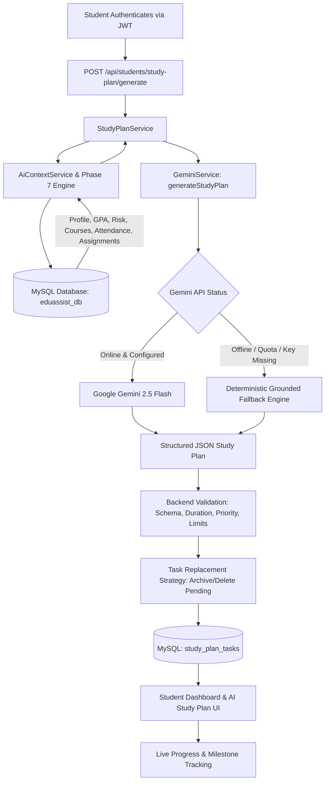

# EduAssistAI — Persistent AI Study Plan Generator Documentation

## 1. Purpose
The Persistent AI Study Plan Generator transforms diagnostic academic intelligence and real LMS coursework data into an actionable, structured, and manageable study roadmap. Grounded in the Phase 7 Academic Analysis Engine and powered by Google Gemini (via the official `@google/genai` SDK), it generates personalized study tasks with realistic deadlines, explicit rationale, and duration estimates. All tasks are saved directly into MySQL (`study_plan_tasks`), enabling students to track completion milestones seamlessly from their dashboard.



---

## 2. Database Architecture (`study_plan_tasks`)
The system reuses and extends the institutional `study_plan_tasks` table in `eduassist_db`:

```sql
CREATE TABLE IF NOT EXISTS study_plan_tasks (
    id INT AUTO_INCREMENT PRIMARY KEY,
    student_id INT NOT NULL,
    title VARCHAR(255) NOT NULL,
    course_code VARCHAR(50) DEFAULT NULL,
    reason TEXT,
    deadline DATE,
    estimated_minutes INT DEFAULT 60,
    priority ENUM('URGENT', 'HIGH', 'MEDIUM', 'LOW') DEFAULT 'MEDIUM',
    status ENUM('pending', 'completed') DEFAULT 'pending',
    resource_link VARCHAR(255),
    created_at TIMESTAMP DEFAULT CURRENT_TIMESTAMP,
    updated_at TIMESTAMP DEFAULT CURRENT_TIMESTAMP ON UPDATE CURRENT_TIMESTAMP,
    FOREIGN KEY (student_id) REFERENCES users(id) ON DELETE CASCADE,
    INDEX idx_task_student (student_id),
    INDEX idx_task_status (status)
) ENGINE=InnoDB DEFAULT CHARSET=utf8mb4 COLLATE=utf8mb4_unicode_ci;
```

### Schema Attributes & Semantics
* `student_id`: Scoped foreign key to `users.id` (strictly resolved via `req.user.id`).
* `title`: Concise action description (max 255 chars).
* `course_code`: Explicit course code mapping (e.g., `CSC203S2`) or `NULL` for cross-cutting tasks.
* `reason`: Explanatory rationale citing empirical academic factors (also exposed as `description`).
* `deadline`: Target completion date (also exposed as `due_date`).
* `estimated_minutes`: Realistic study time allocation (bounded between 15 and 240 minutes).
* `priority`: Urgency categorization (`URGENT`, `HIGH`, `MEDIUM`, `LOW`).
* `status`: Task lifecycle state (`pending`, `completed`).

---

## 3. Grounded Context Builder (`aiContextService.js`)
Before prompting Gemini, `aiContextService.buildStudentContext(studentId)` aggregates authoritative student records:
1. **Student Identity**: Full name, registration number, department, academic year, and semester.
2. **Authoritative GPA Profile**: Current cumulative GPA, baseline GPA, credit count, and trajectory (`IMPROVING`, `STABLE`, `DECLINING`).
3. **Phase 7 Academic Risk Profile**: Diagnostic risk category (`LOW`, `MEDIUM`, `HIGH`), numerical risk score (0–100 Penalty Model), and specific risk reasons.
4. **Attendance Tracking**: Overall attendance percentage, module-by-module breakdown, and debarment warnings ($< 75\%$).
5. **Coursework Standing**: Module examination marks, continuous assessments, and weak subjects (`needsAttention` or CA mark $< 65\%$).
6. **Coursework & Deadlines**: Pending assignments, overdue flags, and upcoming submission dates.
7. **Career Goals & Skills**: Verified competencies and stated career aspirations.

---

## 4. Gemini Integration & Prompt Design (`geminiService.js`)
The plan generator reuses the single `GeminiService` instance:

```javascript
const { GoogleGenAI } = require('@google/genai');
const ai = new GoogleGenAI({ apiKey: config.GEMINI_API_KEY });
```

### Operating Rules Enforced
1. Use only supplied student data.
2. Never invent course names or course codes.
3. Never invent assignment deadlines or coursework details.
4. Never invent marks or academic grades.
5. Never invent university examination policies.
6. Prioritize overdue assignments as `URGENT` tasks.
7. Prioritize academically weak courses (CA marks $< 65\%$ or failing).
8. Consider attendance problems (modules $< 75\%$ require consultation or lecture review).
9. Consider the student's current GPA risk level.
10. Balance study workload realistically across the requested period (e.g. 7 or 14 days).
11. Avoid impossible schedules or overloading single days.
12. Use practical study durations (15 to 240 minutes per task).
13. Generate structured JSON only matching the schema.
14. Explain clearly in the task description why each task is prioritized.
15. Do not generate duplicate tasks unnecessarily.
Maximum allowed tasks: 10 per plan.

### Structured JSON Schema
```json
{
  "planTitle": "7-Day Personalized Academic Improvement Plan",
  "summary": "Focused revision targeting Database Systems CA remediation and pending coursework submission.",
  "tasks": [
    {
      "title": "Complete Database Normalization Set",
      "description": "Remediate low Quiz 1 score in CSC203S2 ahead of midterm assessment.",
      "courseCode": "CSC203S2",
      "priority": "URGENT",
      "estimatedMinutes": 90,
      "dueDate": "2026-09-24"
    }
  ]
}
```

---

## 5. Backend Validation & Safety (`studyPlanService.js`)
All outputs from Gemini or test mocks undergo strict validation before MySQL persistence:
* **Preference Constraints**:
  - `days`: Integer between `1` and `14` (default: 7).
  - `dailyMinutes`: Integer between `30` and `300` (default: 120).
* **Task Array Bounds**: Minimum 1 task, maximum 10 tasks.
* **Title Validation**: Non-empty string, maximum 255 characters.
* **Priority Validation**: Must strictly be one of `['URGENT', 'HIGH', 'MEDIUM', 'LOW']`.
* **Duration Validation**: Integer between `15` and `240` minutes per task.
* **Due Date Validation**: Valid ISO date string or `YYYY-MM-DD`.

---

## 6. Deterministic Grounded Fallback Engine
When the Gemini API is offline, quota-limited, or unconfigured, `geminiService._generateFallbackStudyPlan` constructs a deterministic study plan from empirical MySQL data:
1. **Priority 1 (URGENT)**: Overdue coursework items (`assignments` with `isOverdue = true`).
2. **Priority 2 (HIGH)**: Critical attendance recovery modules ($< 75\%$) requiring consultation and lecture review.
3. **Priority 3 (HIGH)**: Weak academic modules (continuous assessment $< 65\%$) requiring targeted problem-solving.
4. **Priority 4 (MEDIUM)**: Upcoming assignments due within the study period.
5. **Priority 5 (MEDIUM/LOW)**: General module revision for registered coursework.
6. **Priority 6 (LOW)**: Hands-on skill practice aligned with the student's career target.

---

## 7. Plan Replacement & Milestone Persistence
To prevent unbounded duplicate tasks:
* Generating a new plan executes:
  ```sql
  DELETE FROM study_plan_tasks WHERE student_id = ? AND status = 'pending';
  ```
* **Preservation of Accomplishments**: Previously completed tasks (`status = 'completed'`) are **preserved**, allowing students to maintain their historical achievement records.
* **Strict Student Isolation**: The `WHERE student_id = ?` clause ensures students can never overwrite or delete another student's tasks.

---

## 8. Live Progress & Metric Calculation
The study plan API returns both canonical task rows and calculated summary statistics:
$$\text{Completion Percentage} = \text{round}\left(\frac{\text{Completed Tasks}}{\text{Total Tasks}} \times 100\right)$$
$$\text{Total Study Time} = \sum \text{estimated\_minutes}$$
$$\text{Remaining Study Time} = \sum_{\text{pending}} \text{estimated\_minutes}$$

---

## 9. API Reference

| Method | Endpoint | Access | Description |
|---|---|---|---|
| `POST` | `/api/students/study-plan/generate` | Student (JWT) | Generates, validates, and persists a personalized AI study plan. |
| `GET` | `/api/students/study-plan` | Student (JWT) | Retrieves current study plan tasks and calculated progress summary. |
| `PATCH` | `/api/students/study-plan/:id/toggle` | Student (JWT) | Toggles task status (`pending` $\leftrightarrow$ `completed`) with IDOR verification. |
| `PUT` | `/api/students/study-plan/:id/toggle` | Student (JWT) | Backward-compatible alias for Phase 4 client compatibility. |
| `DELETE` | `/api/students/study-plan/:id` | Student (JWT) | Deletes a task with strict IDOR ownership verification. |

### Sample Response: `POST /api/students/study-plan/generate`
```json
{
  "success": true,
  "message": "Personalized study plan generated successfully",
  "data": [
    {
      "id": 12,
      "student_id": 6,
      "title": "Finalize & Submit Coursework: React UI Coursework",
      "course_code": "CSC202S2",
      "course": "CSC202S2",
      "reason": "Overdue submission for CSC202S2. Prioritize immediately to minimize late penalties.",
      "description": "Overdue submission for CSC202S2. Prioritize immediately to minimize late penalties.",
      "deadline": "2026-09-23",
      "due_date": "2026-09-23",
      "estimated_minutes": 90,
      "priority": "URGENT",
      "status": "pending",
      "completed": false,
      "created_at": "2026-09-22T07:28:11.000Z"
    }
  ],
  "summary": {
    "totalTasks": 5,
    "completedTasks": 1,
    "pendingTasks": 4,
    "completionPercentage": 20,
    "totalMinutes": 375,
    "remainingMinutes": 315
  }
}
```

---

## 10. Frontend User Experience
1. **AI Study Plan Page (`AIStudyPlan.jsx`)**:
   - Header with dynamic subtitle and configuration drawer.
   - Summary KPI cards: Academic Risk profile, Cumulative GPA, GPA Trend, Plan Completion %, and Total Study Time.
   - Configuration panel: Selectable study period (7 or 14 days) and daily study budget (60, 90, 120, 180 minutes).
   - Interactive task cards with priority badges (`URGENT`, `HIGH`, `MEDIUM`, `LOW`), course badges, duration chips, deadline tags, and complete/delete buttons.
   - User-friendly loading state ("Creating your personalized study plan...") and safe error state handling.
2. **Student Dashboard Integration (`StudentDashboard.jsx`)**:
   - Added compact **"Today's Study Focus"** card showcasing the highest priority pending task, enrolled course, estimated study minutes, and a direct "View Study Plan" button.
3. **Chatbot Synergy (`EduAssistChatbot.jsx`)**:
   - Updated Quick Action prompt ("Recommend Weekly Study Schedule") to guide students directly to the persistent Study Plan Generator.

---

## 11. Verification & Automated Test Results
Phase 9 is verified via `server/test-phase9.js` with **42 automated assertions**:
* **Authentication & RBAC (5/5)**: Verified student access, blocked missing/invalid JWT (401), blocked lecturer/admin (403).
* **Input Validation (5/5)**: Rejected days $<1$, days $>14$, float days, dailyMinutes $<30$, dailyMinutes $>300$ (400).
* **Data Grounding (5/5)**: Verified context contains real GPA, Phase 7 risk, weak courses, and attendance breakdowns.
* **Schema Validation (4/4)**: Rejected non-object plans, invalid priorities, excessive estimated minutes ($>240$), and $>10$ tasks.
* **Persistence & Management (10/10)**: Verified task insertion, retrieval, toggle, completion percentage calculation, backward-compatible `PUT`, and deletion.
* **Security & IDOR Audits (5/5)**: Confirmed cross-student task toggle and deletion return 404; confirmed zero leakage of `password_hash`, bcrypt signatures, and `GEMINI_API_KEY`.
* **Gemini Mocking & Resilience (4/4)**: Custom mock injection verified, simulated API quota error handled gracefully, deterministic fallback verified.

### Full Cumulative Regression Results (`npm run test:all`)
```
====================================================
PHASE 4 TOTAL: Passed: 81 | Failed: 0
====================================================
====================================================
PHASE 6 TOTAL: Passed: 37 | Failed: 0
====================================================
====================================================
PHASE 7 TOTAL: Passed: 31 | Failed: 0
====================================================
====================================================
PHASE 8 TOTAL: Passed: 37 | Failed: 0
====================================================
====================================================
PHASE 9 TOTAL: Passed: 42 | Failed: 0
====================================================

TOTAL ASSERTIONS: 228 Passed | 0 Failed
```
